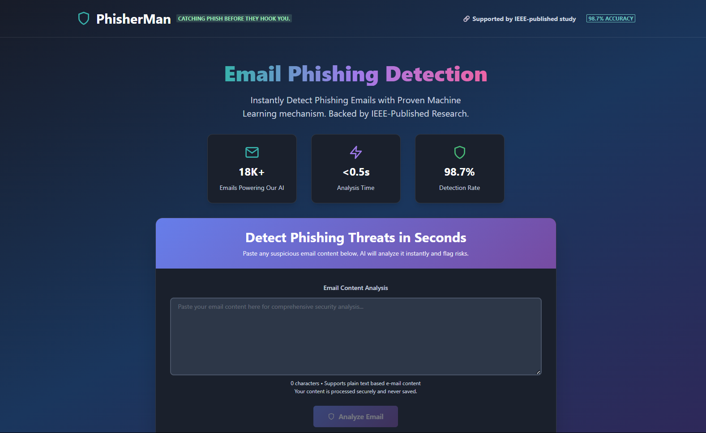
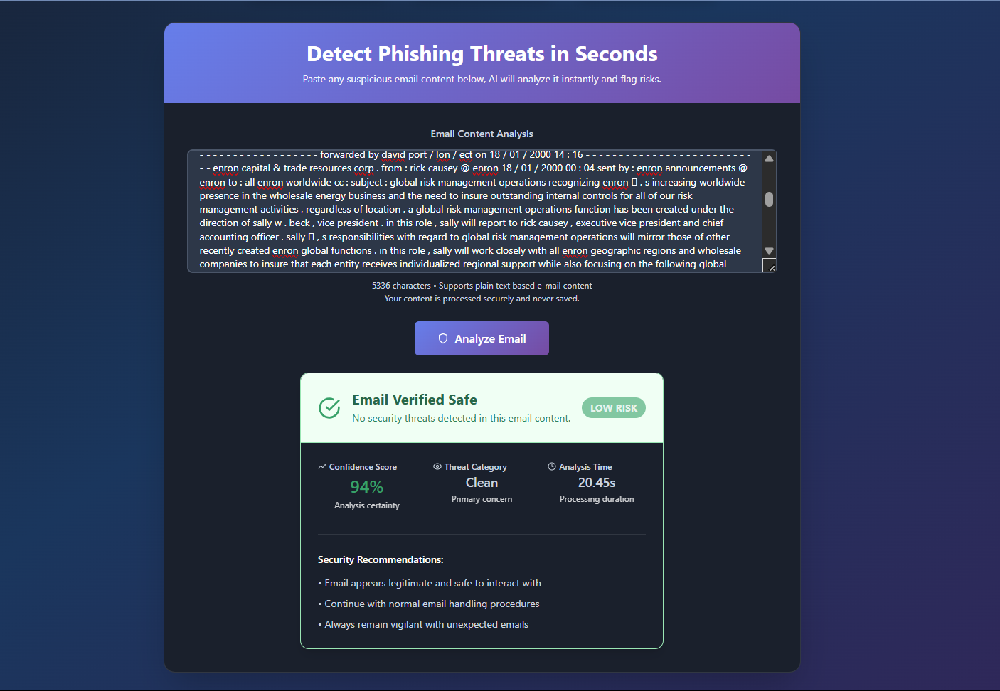

## CatPhish AI: Email Phishing Detection using an Ensemble ML Approach

## Demo

  

 

---

---

## Overview

**CatPhish AI** is a real-time phishing email detection system built on the research work titled **"Unified Approach Integrating Machine Learning Algorithms for Detection of e-Mail Phishing Attacks"**, published at the **2024 International Conference on Computing, Sciences and Communications (ICCSC)**.

This application leverages a hybrid ensemble of NLP-powered **Support Vector Machine** and **Random Forest** models. It delivers precise classification of email content as **Phishing Email** or **Safe Email**, and is backed by a Flask API and a Chakra UI React frontend.

---

## Authors

- **Abeer Mathur** – [LinkedIn](https://in.linkedin.com/in/abeermathur) | [Website](https://abeermathur.in) | [ORCID](https://orcid.org/0009-0004-3129-0749)
- **Abhinav Sudhakar Dubey**
- **Pranav Singh Mahara**
- **Usha Devi Gandhi**

> Affiliation: Vellore Institute of Technology, Vellore, India  
> Contact: abeermathur17@gmail.com | dubey.abhinav2003@gmail.com | pranavsmahara@gmail.com | ushadevi.g@vit.ac.in

---

## Project Highlights

- **Problem Addressed:**  
  With over 3.4 billion phishing emails sent daily and incidents taking up to 295 days to detect, email phishing remains a critical cybersecurity threat.

- **Solution Provided:**  
  A unified ensemble model combining:
  - **Natural Language Processing (NLP)** for semantic understanding
  - **Support Vector Machine (SVM)** for high-precision classification
  - **Random Forest (RF)** for decision robustness

- **Backend:** Python Flask API serving a `.pkl` model trained via Scikit-learn.
- **Frontend:** React + Chakra UI user interface.
- **Deployment:** Dockerized and deployed on Render.

---

## Research Summary

### Abstract
With the ever-rising risk of phishing attacks, which capitalize on vulnerable human behavior in the contemporary digital space, requires new cybersecurity methods. This literary work contributes to the solution by novel incorporation of three techniques: Support Vector Machine (SVM), Natural Language Processing (NLP) and Random Forest (RF). Utilizing NLP for deep analysis of text in phishing e-mails, SVM for strong categorization and Random Forest's decision making by group helps in improving detection. This combination of language and pattern analysis along with group learning builds a fortified system. This approach differs from prior work on a variety of factors such as reliability, security, integrity, scalability, interpretability, transparency, and robustness. Thorough evaluation on a reliable dataset aimed to demonstrate the method's effectiveness, which resulted in 98.7 % of accuracy in detection. This majorly aims at showcasing the potential of ensemble techniques to combat against cyber-attacks like phishing for laying a strong foundation for a secure digital environment.

---

## Methodology

### 1. Dataset

- **Source:** Public Kaggle Dataset — *Phishing Email Detection*
- **Samples:** 11,376 safe emails + 7,274 phishing emails
- **Features:** 
  - `Email Text`
  - `Email Type` (Phishing / Safe)

### 2. Preprocessing

- Missing value handling
- Train-test split with reproducibility seed
- **TF-IDF Vectorizer** (max features: 10,000, English stopwords removed)

### 3. Unified Model Architecture

- **VotingClassifier** (soft voting)
  - `RandomForestClassifier(n_estimators=100, max_depth=20)`
  - `SVC(kernel='linear', probability=True, C=1)`
- Optimized with:
  - Grid Search
  - Cross-validation (5-fold)
  - Class weighting (phishing: 2, safe: 1)

---

## Evaluation Metrics

| Metric        | Phishing Email | Safe Email | Macro Avg | Weighted Avg |
|---------------|----------------|------------|-----------|--------------|
| Precision     | 0.97           | 0.99       | 0.98      | 0.99         |
| Recall        | 0.99           | 0.98       | 0.99      | 0.98         |
| F1 Score      | 0.98           | 0.99       | 0.99      | 0.99         |
| Accuracy      |                |            |           | **98.7%**     |

---

## Comparative Analysis

| Model              | Accuracy | Precision | Recall | F1-Score |
|--------------------|----------|-----------|--------|----------|
| Logistic Regression| 95%      | 95%       | 72%    | 82%      |
| Naive Bayes        | 97%      | 100%      | 80%    | 89%      |
| Decision Trees     | 93%      | 85%       | 61%    | 71%      |
| K-Nearest Neighbors| 90%      | 100%      | 29%    | 45%      |
| Random Forest      | 97%      | 97%       | 81%    | 89%      |
| **Unified Model**  | **98%**  | **99%**   | **98%**| **99%**  |

---

## UI Features

- ✅ Input box for full email content
- 📊 Real-time prediction
- 🔐 Confidence score output
- 🟢 "Safe Email" / 🔴 "Phishing Email" tag display

---

## Key Contributions

- Novel ensemble model for email phishing detection
- Robust evaluation using a large, real-world dataset
- Real-time web application with a clean UX
- Deployment with Docker and cloud hosting (Render)
- Recieved the <a href='https://drive.google.com/file/d/1zaF3hzDAvVsis8lvLv3ACJkIKMAluVs0/view?usp=sharing'>*Best Paper Award*</a> in the AI/ML track.

---

## Acknowledgments

- Kaggle – for the dataset
- IEEE ICCSC 2024 – for peer-reviewed publication
- VIT University – for research guidance

---

## License

This repository is intended for **academic and research purposes only**.  
Model weights and source code are **not licensed for commercial use**.

If you use this work in your research, please cite it as follows:

### APA
Mathur, A., Dubey, A. S., Mahara, P. S., & Gandhi, U. D. (2024, October). Unified approach integrating Machine Learning algorithms for detection of e-mail phishing attacks. In 2024 International Conference on Computing, Sciences and Communications (ICCSC) (pp. 1-7). IEEE. DOI: [10.1109/ICCSC62048.2024.10830374](https://ieeexplore.ieee.org/abstract/document/10830374)

### MLA
Mathur, Abeer, et al. "Unified approach integrating Machine Learning algorithms for detection of e-mail phishing attacks." 2024 International Conference on Computing, Sciences and Communications (ICCSC). IEEE, 2024. DOI: [10.1109/ICCSC62048.2024.10830374](https://ieeexplore.ieee.org/abstract/document/10830374).

### IEEE
A. Mathur, A. S. Dubey, P. S. Mahara and U. D. Gandhi, "Unified Approach Integrating Machine Learning Algorithms for Detection of e-Mail Phishing Attacks," 2024 International Conference on Computing, Sciences and Communications (ICCSC), Ghaziabad, India, 2024, pp. 1-7. DOI: [10.1109/ICCSC62048.2024.10830374](https://ieeexplore.ieee.org/abstract/document/10830374).

### BibTeX
```bibtex
@inproceedings{mathur2024unified,
  title={Unified approach integrating Machine Learning algorithms for detection of e-mail phishing attacks},
  author={Mathur, Abeer and Dubey, Abhinav Sudhakar and Mahara, Pranav Singh and Gandhi, Usha Devi},
  booktitle={2024 International Conference on Computing, Sciences and Communications (ICCSC)},
  pages={1--7},
  year={2024},
  organization={IEEE}
}
```
---


